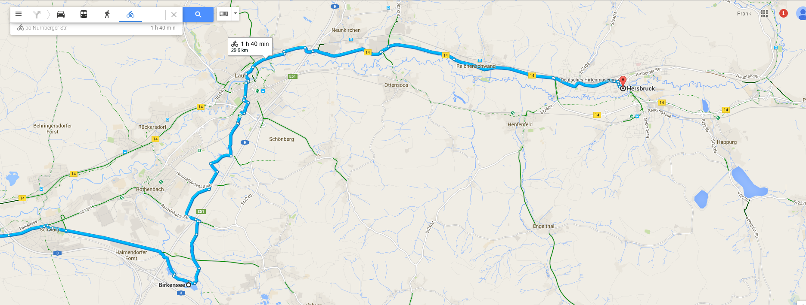

# hello world
This blog rulez!

## Inserting image using plain HTML


## ...and markdown
(the image was too big, fucking up the layout)

## Code
Here we'd like to have some code in clojure (demo of infinite power of `defn`):
```clojure
(defn hi [n]
  (str "Hi " n))

; comment
(defn some-other-fc [xs]
  (map #(str "hi " %) xs))
```

..., and in java:
```java
public static void main(String ... args) {
    System.out.println("test");
}
```

[next](second.md)

